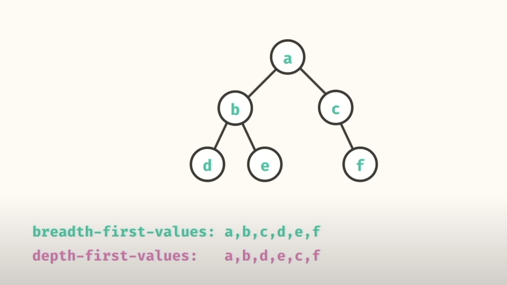
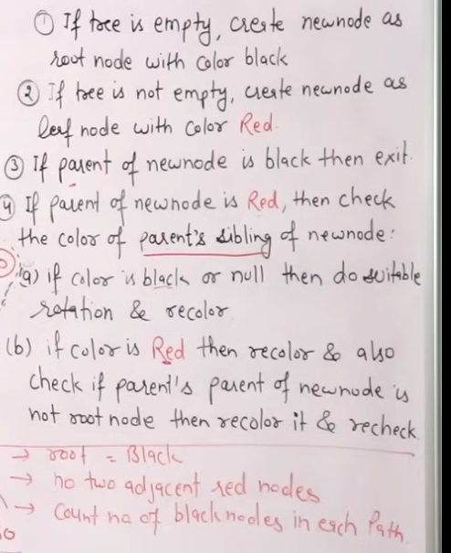

# Trees

_Source [here](https://www.geeksforgeeks.org/types-of-trees-in-data-structures/)_


## Generic Trees (N-ary Trees)

_Source [here](https://www.geeksforgeeks.org/generic-treesn-array-trees/?ref=outind)_

A collection of nodes where each node consists a reference to children nodes. Every node stores address of its children and very first node's address will be stored in a separate entry called root.

### Representing Trees as Arrays or Lists

The trees can be represented with arrays or linked lists, but we have the following disadvantages:
- In Linked list, we can not randomly access any child’s address. So it will be expensive.
- In array, we can randomly access the address of any child, but we can store only fixed number of children’s addresses in it.

Better approach: using dynamic arrays. We can randomly access any child’s address and the size of the vector is also not fixed.

```swift
class GenericTreeNode<T> {
    var data: T
    var children: [T]

    init(data: T, children: [T]) {
        self.data = data
        self.children = children
    }
}
```

### Representing Trees with First Child / Next Sibling

1. **First Child**: Each node in the tree has a link (or pointer) to its first child (if it has any children).
2. **Next Sibling**: Each node also has a link to its next sibling, which is the next child of the same parent (if it has any siblings).

The first step in this representation is to link all children of the same parent together from left to right. For example, if a node has three children, the first child will point to the second child, and the second child will point to the third child using the "next sibling" link.

In a standard tree representation, each parent node usually has direct links to all of its children. However, in the First Child/Next Sibling representation, the parent only retains a direct link to its first child. This is because the next sibling of that first child can be accessed through the "next sibling" link of the first child. The parent doesn't need to have direct links to all its children since these can be accessed by traversing through the sibling links.

```mathematica
  A
/ | \
B C  D
/ |  |
E F  G
```

In a traditional representation, the parent node A would have direct links to B, C, and D. Node B would have links to E and F, and C would have a link to G.

In the First Child/Next Sibling representation, the tree is reorganized as:

```mathematica
A
|
B -> C -> D
|
E -> F
|
G
```

- `A` points to its first child `B`.
- `B` points to its first child `E` and its next sibling `C`.
- `C` points to its first child `G` and its next sibling `D`.
- `D` has no children, so it doesn't point to any other node.
- `E` and `F` are siblings, so `E` points to `F`.

### Advantages

- Memory efficient – No extra links are required, hence a lot of memory is saved.
- Treated as binary trees – Since we are able to convert any generic tree to binary representation, we can treat all generic trees with a first child/next sibling representation as binary trees. Instead of left and right pointers, we just use firstChild and nextSibling.
- Many algorithms can be expressed more easily because it is just a binary tree.
- Each node is of fixed size, so no auxiliary array or vector is required.

### Complexity

- Time Complexity - O(n)
- Space Complexity - O(n), where `n` is the height of the tree (the maximum depth of any node)

For binary trees where the tree is balance the space complexity is O(log n).

### Traversals

Given the N-ary tree:

```
      A
   /  | \
  B   C  D
 / \  | \
E  F  G  H
```

The orders for the different traversals would be:

1. Pre-order Traversal:
- Order: A B E F C G H D
2. Post-order Traversal:
- Order: E F B G H C D A
3. Level-order Traversal:
- Order: A B C D E F G H

#### Resources

- https://www.codecademy.com/article/tree-traversal
- https://sbme-tutorials.github.io/2020/data-structure-FALL/notes/week08.html

## Binary Trees

Each node has only two children.

Internal nodes = the nodes that are not leaves

### Traversals



### Degenerate Binary Tree

A degenerate binary tree, also known as a pathological binary tree, is a type of binary tree where each parent node has only one child. This means that the tree is essentially a linked list, with no node having two children.

The height equals number of nodes. Complexity is O(n).

The tree is highly unbalanced, as all nodes are aligned along a single path.

### Full Binary Tree

A full binary tree is a binary tree with either zero or two child nodes for each node.


### Complete Binary Tree

A complete binary tree is a binary tree in which all levels, except possibly the last, are completely filled, and all nodes are as far left as possible.


### Perfect Binary Tree

A perfect binary tree is a special type of binary tree in which all the leaf nodes are at the same depth, and all non-leaf nodes have two children. In simple terms, this means that all leaf nodes are at the maximum depth of the tree, and the tree is completely filled with no gaps.


### Balanced Binary Tree

A height balanced binary tree is a binary tree in which the height of the left subtree and right subtree of any node does not differ by more than 1 and both the left and right subtree are also height balanced.

This property ensures that the tree remains relatively flat and well-proportioned, leading to efficient operations such as insertion, deletion, and lookup, which can be performed in logarithmic time (`O(log n`)).


### Binary Search Tree

A Binary Search Tree is a data structure used in computer science for organizing and storing data in a sorted manner. Each node in a Binary Search Tree has at most two children, a left child and a right child, with the left child containing values less than the parent node and the right child containing values greater than the parent node.


### AVL Tree

An AVL tree defined as a self-balancing Binary Search Tree (BST) where the difference between heights of left and right subtrees for any node cannot be more than one.

The difference between the heights of the left subtree and the right subtree for any node is known as the **balance factor** of the node.


- **Height Balance**: AVL trees maintain height balance by ensuring the balance factor of every node is within -1 to 1.
- **Balance Factor**: This is calculated as the difference between the heights of the left and right subtrees.
- **Maintaining Balance**: Insertions and deletions might disrupt the balance, requiring rotations to restore it.

Benefits of AVL Trees:
- Guaranteed O(log n) Time Complexity: Since AVL trees maintain balance, the height of the tree is kept at O(log n), ensuring that operations like search, insert, and delete are performed in O(log n) time.
- Self-Balancing: AVL trees automatically adjust after operations, making them efficient for use in scenarios where frequent insertions and deletions occur.

#### Left Rotation


#### Right Rotation


#### Left-Right Rotation


#### Right-Left Rotation


### Red-Black Tree

Red Black Trees are a type of balanced binary search tree that use a set of rules to maintain balance, ensuring logarithmic time complexity for operations like insertion, deletion, and searching, regardless of the initial shape of the tree. Red Black Trees are self-balancing, using a simple color-coding scheme to adjust the tree after each modification.


#### Why Red-Black Trees?

Most of the BST operations (e.g., search, max, min, insert, delete.. etc) take O(h) time where h is the height of the BST. The cost of these operations may become O(n) for a skewed Binary tree. If we make sure that the height of the tree remains O(log n) after every insertion and deletion, then we can guarantee an upper bound of O(log n) for all these operations. The height of a Red-Black tree is always O(log n) where n is the number of nodes in the tree.

_[Source here](https://www.geeksforgeeks.org/introduction-to-red-black-tree/)_

**Complexity**

1.	Search	O(log n)
2.	Insert	O(log n)
3.	Delete	O(log n)

#### Rules



_[Source here](https://www.youtube.com/watch?v=qA02XWRTBdw&ab_channel=Jenny%27sLecturesCSIT)_
- Video: 5.17 Red Black Tree Insertion | Insertion Algorithm | Data Structure Tutorials
- Youtube channel: [Jenny's Lectures CS IT](https://www.youtube.com/@JennyslecturesCSIT)

### B-Tree

A B-Tree is a self-balancing tree data structure commonly used in databases and file systems to manage large amounts of sorted data efficiently. It is designed to allow for fast data retrieval, insertion, and deletion while keeping the tree balanced.


### B-Tree+


_Source [here](https://www.geeksforgeeks.org/introduction-of-b-tree/)_

B-Tree+ (often referred to as B+ Tree) is a variant of the B-Tree that is used extensively in databases and file systems. It’s designed to enhance the efficiency of operations like searching, insertion, and deletion. Here's a simple explanation of B+ Trees and their key features:

1. Structure:
- Internal Nodes: Only store keys and act as routing nodes to guide the search process.
- Leaf Nodes: Store both keys and actual data (or pointers to data). Leaf nodes are linked together in a sorted order for efficient range queries.

2. Leaf Nodes:
- Linked List: All leaf nodes are connected in a linked list, making range queries (e.g., finding all records between two values) very efficient. This is because you can easily traverse the leaf nodes sequentially.

3. All Keys in Leaves:
- Keys: All keys are stored in the leaf nodes, not in the internal nodes. Internal nodes only contain keys to help navigate to the correct leaf node.

4. Balanced Tree:
- Like B-Trees, B+ Trees are also balanced. This means all leaf nodes are at the same level, ensuring that the tree remains balanced and operations are efficient.

### Segment Tree

Segment Tree is a versatile data structure used in computer science and data structures that allows efficient querying and updating of intervals or segments of an array. It is particularly useful for problems involving range queries, such as finding the sum, minimum, maximum, or any other operation over a specific range of elements in an array. The tree is built recursively by dividing the array into segments until each segment represents a single element. This structure enables fast query and update operations with a time complexity of O(log n), making it a powerful tool in algorithm design and optimization.


